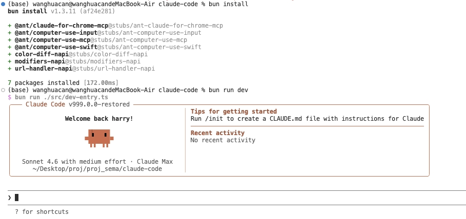

<div align="center">

# Claude Code

**Anthropic's Official AI Coding Assistant CLI — Source Research Edition**


Claude Code is a terminal-based AI coding assistant deeply integrated with Claude models. It supports code writing, debugging, refactoring, code review, multi-agent collaboration, and other complex engineering tasks. This repository is a snapshot of the core source code.

<br/>



*After `bun install`, `bun run dev` launches Claude Code directly from source into the interactive REPL*

</div>

---

## Quick Start

### Prerequisites

- [Bun](https://bun.sh) **v1.3.5+** (verify with `bun --version`; upgrade with `bun upgrade`)
- `ANTHROPIC_API_KEY` environment variable (required for interactive mode)

### Installation

```bash
# After cloning the repo, run in the project root:
bun install
```

### Launch

```bash
# Option 1: Via npm script (recommended)
bun run dev

# Option 2: Run the entry file directly (equivalent)
bun run src/dev-entry.ts

# Option 3: Executable script (root directory)
./claude-dev
```

### Common Commands

```bash
# Show version
bun run dev --version

# Show help
bun run dev --help

# Interactive REPL (requires ANTHROPIC_API_KEY)
export ANTHROPIC_API_KEY=your_key_here
bun run dev

# Non-interactive print mode (single conversation then exit)
bun run dev --print "Write a bubble sort for me"

# Run with a specific working directory
bun run dev --add-dir /path/to/project
```

---

## How It Works

### Startup Entry Chain

```
claude-dev  (executable script, root directory)
  └── bun run src/dev-entry.ts
        └── src/entrypoints/cli.tsx   ← actual CLI entry
              └── main()              ← Commander.js command parsing + routing
                    ├── --version / --help / --print → handled directly
                    └── interactive mode → launchRepl() → screens/REPL.tsx
```

#### Why is `dev-entry.ts` needed?

`src/entrypoints/cli.tsx` uses the Bun bundler-specific API `bun:bundle` (for compile-time feature flags / dead code elimination), which cannot be interpreted directly by `bun run`. `dev-entry.ts` simulates constants injected at bundle time via `globalThis.MACRO`, allowing the source code to run without a build step:

```typescript
// dev-entry.ts does two key things:

// 1. Inject bundle-time constants (replacing values bun build injects at compile time)
globalThis.MACRO = {
  VERSION: pkg.version,
  BUILD_TIME: '',
  PACKAGE_URL: pkg.name,
  // ...
}

// 2. After validating all relative imports are resolvable, dynamically import the real entry
await import('./entrypoints/cli.tsx')
```

### Shims Explained

Some Anthropic-internal packages are not publicly published and are replaced by stub modules in the `stubs/` directory:

| Package | Location | Description |
|---------|----------|-------------|
| `@ant/computer-use-mcp` | `stubs/ant-computer-use-mcp` | macOS screen control (screenshot / mouse / keyboard) |
| `@ant/computer-use-input` | `stubs/ant-computer-use-input` | Low-level input device control (Rust/enigo) |
| `@ant/computer-use-swift` | `stubs/ant-computer-use-swift` | macOS Swift native screenshot API |
| `@ant/claude-for-chrome-mcp` | `stubs/ant-claude-for-chrome-mcp` | Chrome browser control MCP service |
| `color-diff-napi` | `stubs/color-diff-napi` | Syntax highlight diff rendering (Native Addon) |
| `modifiers-napi` | `stubs/modifiers-napi` | Keyboard modifier key state detection |
| `url-handler-napi` | `stubs/url-handler-napi` | macOS URL scheme registration |

These shims are empty implementations or return default values and do not affect core AI conversation and code operation capabilities.

### Feature Flags (`bun:bundle` compile-time decisions)

The production bundle uses `bun:bundle`'s `feature()` macro to decide whether to include certain code **at bundle time**. In development mode (launched via `dev-entry.ts`), all `feature()` calls return `false`, meaning all experimental features are disabled by default, keeping only the core functionality paths.

```typescript
// Example: activate a specific feature only in the production bundle
if (feature('KAIROS')) {
  // Advanced assistant mode code — this branch is skipped in dev mode
}
```

### Key Source Files

| File | Description |
|------|-------------|
| `src/dev-entry.ts` | Development startup entry, injects MACRO constants and validates dependency completeness |
| `src/entrypoints/cli.tsx` | CLI bootstrap, handles fast paths (--version etc.) and mode routing |
| `src/main.tsx` | Main application logic: Commander command tree, REPL startup, session initialization |
| `src/query.ts` | LLM query processing main loop |
| `src/QueryEngine.ts` | Query engine core, manages API calls and tool orchestration |

---

## Table of Contents

- [Architecture Overview](#architecture-overview)
- [Directory Structure](#directory-structure)
- [Core Concepts](#core-concepts)
  - [Query Engine](#query-engine)
  - [Tool System](#tool-system)
  - [Command System](#command-system)
  - [Hooks Mechanism](#hooks-mechanism)
  - [Permission System](#permission-system)
  - [Task System](#task-system)
  - [MCP Integration](#mcp-integration)
- [Tech Stack](#tech-stack)
- [Feature Flag System](#feature-flag-system)
- [Key Data Flows](#key-data-flows)
- [Module Reference](#module-reference)
- [Environment Variables](#environment-variables)

---

## Architecture Overview

```
┌─────────────────────────────────────────────────────────┐
│                      Entry Layer                         │
│  entrypoints/cli.tsx   entrypoints/init.ts   setup.ts  │
└───────────────────────────┬─────────────────────────────┘
                            │
┌───────────────────────────▼─────────────────────────────┐
│                  Main App Loop (main.tsx)                │
│       Command Parsing → Message Handling → UI Mgmt       │
└──────────┬──────────────────────────┬────────────────────┘
           │                          │
┌──────────▼──────────┐  ┌────────────▼────────────────────┐
│   Command System     │  │         Query Engine             │
│  commands/ (103+)   │  │  query.ts + QueryEngine.ts       │
│  PromptCommand      │  │  ↕ services/api/claude.ts        │
│  LocalCommand       │  │        (Anthropic SDK)           │
└─────────────────────┘  └─────────────┬───────────────────┘
                                       │
                          ┌────────────▼────────────────────┐
                          │       Tool Execution Layer       │
                          │  tools/ (44+) + toolHooks.ts    │
                          │  PreToolUse → call → PostToolUse│
                          └─────────────┬───────────────────┘
                                       │
           ┌───────────────────────────┼───────────────────────┐
           │                           │                       │
┌──────────▼──────┐      ┌─────────────▼──────┐   ┌───────────▼──────┐
│ Permission Layer │      │   State Layer        │   │   UI Layer       │
│ useCanUseTool   │      │  AppState (Zustand)  │   │  React + Ink     │
│ permissions/    │      │  context/            │   │  components/     │
└─────────────────┘      └────────────────────┘   └──────────────────┘
           │
┌──────────▼──────────────────────────────────────────────────────────┐
│                          Support Services                            │
│  MCP Integration | OAuth | LSP | Context Compression | Analytics    │
└─────────────────────────────────────────────────────────────────────┘
```

---

## Directory Structure

```
src/
├── entrypoints/          # Multiple application entry points
│   ├── cli.tsx           # CLI main entry, handles --version, --dump-system-prompt, etc.
│   └── init.ts           # Initialization: Node version check, Session management, Worktree support
├── main.tsx              # Application main loop (4,683 lines)
├── setup.ts              # Startup config: permission modes, Tmux integration, logging init
├── query.ts              # Query processing main logic (1,729 lines)
├── QueryEngine.ts        # Query engine core (1,295 lines)
├── Tool.ts               # Tool type definitions and interfaces (792 lines)
├── commands.ts           # Command registry (100+ commands)
├── context.ts            # Git status and system context management
│
├── tools/                # 44+ tool implementations
│   ├── BashTool/
│   ├── FileEditTool/
│   ├── FileReadTool/
│   ├── FileWriteTool/
│   ├── GlobTool/
│   ├── GrepTool/
│   ├── WebFetchTool/
│   ├── WebSearchTool/
│   ├── MCPTool/
│   ├── AgentTool/
│   ├── SkillTool/
│   ├── TaskCreateTool/
│   ├── EnterPlanModeTool/
│   ├── NotebookEditTool/
│   └── ... (more tools)
│
├── commands/             # 103+ command implementations
│   ├── commit/
│   ├── review/
│   ├── config/
│   ├── mcp/
│   ├── skills/
│   ├── memory/
│   ├── tasks/
│   └── ... (more commands)
│
├── services/             # 38+ services
│   ├── api/              # Anthropic API client (22 sub-modules)
│   │   ├── claude.ts     # API calls, streaming, retry logic
│   │   └── errors.ts
│   ├── tools/            # Tool execution orchestration
│   │   ├── toolOrchestration.ts
│   │   ├── toolExecution.ts
│   │   └── StreamingToolExecutor.ts
│   ├── mcp/              # MCP server management (25 sub-modules)
│   ├── compact/          # Automatic context compression
│   ├── analytics/        # Analytics tracking
│   ├── lsp/              # Language Server Protocol
│   ├── oauth/            # OAuth 2.0 authentication
│   └── ...
│
├── state/                # Application state management
│   ├── AppState.tsx      # React state definitions
│   ├── AppStateStore.ts  # State store
│   └── store.ts          # Zustand store implementation
│
├── hooks/                # 87+ React Hooks
│   ├── useCanUseTool.ts  # Tool permission checks
│   ├── useTasksV2.ts     # Task management
│   ├── useQueueProcessor.ts
│   ├── useVoice.ts       # Voice integration
│   └── ...
│
├── components/           # 146+ React components
├── ink/                  # Terminal UI rendering layer (50 files)
├── types/                # TypeScript type definitions
│   ├── message.ts
│   ├── command.ts
│   ├── hooks.ts
│   └── permissions.ts
│
├── utils/                # 298+ utility function modules
│   ├── config.ts
│   ├── permissions/
│   ├── model/
│   ├── bash/             # Bash parser (bashParser.ts 4,436 lines)
│   └── ...
│
├── bootstrap/            # Startup state initialization
├── tasks/                # Task system implementation
├── skills/               # Skills system
├── plugins/              # Plugin system
├── bridge/               # Bridge communication (33 files)
├── coordinator/          # Multi-agent coordination
├── memdir/               # Memory directory management
├── migrations/           # Data migrations
├── remote/               # Remote operations
├── schemas/              # Data schemas
├── vim/                  # Vim mode support
└── keybindings/          # Keyboard shortcut configuration
```

---

## Core Concepts

### Query Engine

The query engine is the heart of the system, responsible for interacting with the Claude API and orchestrating tool calls.

**Main entries**: `src/query.ts` + `src/QueryEngine.ts`

```typescript
export type QueryEngineConfig = {
  cwd: string
  tools: Tools
  commands: Command[]
  mcpClients: MCPServerConnection[]
  canUseTool: CanUseToolFn
  getAppState: () => AppState
  setAppState: (f: (prev: AppState) => AppState) => void
  customSystemPrompt?: string
  userSpecifiedModel?: string
  thinkingConfig?: ThinkingConfig
  maxTurns?: number
  maxBudgetUsd?: number
}
```

**Execution flow**:

```
User input
  ↓
Message normalization (normalizeMessagesForAPI)
  ↓
System prompt preparation (getSystemPrompt)
  ↓
API call (services/api/claude.ts)  — streaming response
  ↓
Tool call handling (runTools)
  ├── Concurrency-safe tools → parallel execution
  └── Destructive tools → serial execution
  ↓
Result aggregation → continue conversation or end
```

---

### Tool System

Tools are the basic units through which Claude interacts with external systems.

**Tool interface definition** (`src/Tool.ts`):

```typescript
export type Tool<Input, Output, P extends ToolProgressData> = {
  name: string
  aliases?: string[]
  
  // Core execution method
  call(args: z.infer<Input>, context: ToolUseContext, canUseTool: CanUseToolFn): Promise<ToolResult<Output>>
  
  // Concurrency and read-only declarations
  isConcurrencySafe(input: z.infer<Input>): boolean
  isReadOnly(input: z.infer<Input>): boolean
  isDestructive?(input: z.infer<Input>): boolean
  
  // Input validation schema
  readonly inputSchema: Input
}
```

**Built-in tool list**:

| Category | Tools |
|----------|-------|
| File operations | FileReadTool, FileWriteTool, FileEditTool, GlobTool, GrepTool, NotebookEditTool |
| Command execution | BashTool, PowerShellTool, REPLTool (ant-only) |
| Network | WebFetchTool, WebSearchTool |
| AI / Agents | AgentTool, SkillTool, SendMessageTool |
| Task management | TaskCreateTool, TaskUpdateTool, TaskListTool, TaskGetTool, TaskStopTool, TaskOutputTool |
| Mode control | EnterPlanModeTool, ExitPlanModeTool, EnterWorktreeTool, ExitWorktreeTool |
| MCP | MCPTool, ListMcpResourcesTool, ReadMcpResourceTool, McpAuthTool |
| Scheduling | ScheduleCronTool, RemoteTriggerTool |
| Other | TodoWriteTool, ToolSearchTool, AskUserQuestionTool, SleepTool |

---

### Command System

Commands come in two types:

```typescript
// Local command — executed directly, bypasses LLM
type LocalCommand = {
  type: 'local'
  supportsNonInteractive: boolean
  load: () => Promise<LocalCommandModule>
}

// Prompt command — generates a system prompt injected into the query engine
type PromptCommand = {
  type: 'prompt'
  progressMessage: string
  allowedTools?: string[]
  model?: string
  source: 'builtin' | 'mcp' | 'plugin' | 'bundled'
  getPromptForCommand(args: string, context: ToolUseContext): Promise<ContentBlockParam[]>
}
```

**Common commands**:

| Category | Commands |
|----------|----------|
| Git workflow | commit, diff, review, branch, pr_comments |
| Configuration | config, model, permissions, keybindings, theme |
| Session management | clear, compact, resume, export, copy |
| Code analysis | cost, context, files, stats |
| Tool management | mcp, skills, plugins, memory |
| Task management | tasks, agent, session |
| Account | login, logout, usage, upgrade |
| Debugging | doctor, debug-tool-call, heapdump, perf-issue |
| Other | help, version, vim, voice, init |

---

### Hooks Mechanism

Hooks allow injecting custom logic at various lifecycle points of tool calls.

**Hook event types**:

| Event | When triggered |
|-------|----------------|
| `PreToolUse` | Before a tool call; can modify input parameters |
| `PostToolUse` | After a tool call succeeds |
| `PostToolUseFailure` | After a tool execution fails |
| `UserPromptSubmit` | When the user submits a message |
| `SessionStart` | When a session starts |
| `Setup` | During application initialization |
| `PermissionDenied` | When permission is denied |
| `Notification` | On notification events |
| `SubagentStart` | When a sub-agent starts |
| `PreCompact` / `PostCompact` | Before/after context compression |

**Hook execution flow**:

```typescript
// 1. Retrieve matching hooks from config
// 2. Sort by priority
// 3. Execute in order, supports early termination
// 4. Each hook can return:
//    - continue: false  → stop subsequent hooks
//    - decision: 'block' → reject the tool call
//    - updatedInput      → modify the tool's input parameters
```

---

### Permission System

The permission system controls whether tools can be executed automatically or require user confirmation.

**Permission modes**:

| Mode | Description |
|------|-------------|
| `default` | Prompt user for confirmation on sensitive operations |
| `bypassPermissions` | Auto-approve all operations (dangerous mode) |
| `dontAsk` | Do not ask again within the current session |
| `acceptEdits` | Auto-approve only non-destructive operations |
| `plan` | Show action plan first, wait for user confirmation |
| `auto` | Automatic decision via TRANSCRIPT_CLASSIFIER |

**Permission check flow**:

```
Tool call request
  ↓
1. Find matching permission rules (allow/deny)
  ↓
2. Execute PreToolUse hooks
  ↓
3. Evaluate by permission mode
  ├── bypassPermissions/dontAsk → approve directly
  ├── acceptEdits → check whether operation is destructive
  ├── plan → show plan and wait for confirmation
  └── default → prompt user
  ↓
4. Return PermissionResult { approved, reason }
```

---

### Task System

The task system supports concurrent execution of multiple task types in the background.

**Task types**:

| Type | Description |
|------|-------------|
| `local_bash` | Local Bash command task |
| `local_agent` | Local agent task |
| `remote_agent` | Remote agent task |
| `in_process_teammate` | In-process teammate task (multi-agent collaboration) |
| `local_workflow` | Local workflow task |
| `monitor_mcp` | MCP monitoring task |

**Task states**: `pending` → `running` → `completed` / `failed` / `killed`

---

### MCP Integration

Claude Code deeply integrates [Model Context Protocol (MCP)](https://modelcontextprotocol.io), enabling connections to external services (databases, browsers, Slack, etc.).

**Service implementation**: `src/services/mcp/client.ts` (3,348 lines)

Features include:
- MCP server connection management (stdio / SSE / HTTP)
- Dynamic tool and resource discovery
- OAuth authentication support
- Structured content (images, files) support
- MCP server permission approval flow

---

## Tech Stack

| Technology | Version / Notes |
|------------|----------------|
| **Runtime** | Bun |
| **Language** | TypeScript (strict mode) |
| **Terminal UI** | React + [Ink](https://github.com/vadimdemedes/ink) |
| **State management** | Zustand |
| **Schema validation** | Zod v4 |
| **AI SDK** | @anthropic-ai/sdk |
| **MCP SDK** | @modelcontextprotocol/sdk |
| **CLI parsing** | Commander.js |
| **File search** | ripgrep |
| **Utility library** | lodash-es |
| **Feature flags** | bun:bundle (compile-time elimination) |

---

## Feature Flag System

Uses Bun's `bun:bundle` for **compile-time dead code elimination** — inactive feature code never appears in the output bundle:

```typescript
import { feature } from 'bun:bundle'

// Decide at compile time whether to include this code
const proactiveTool = feature('PROACTIVE') ? SleepTool : null
const voiceMode = feature('VOICE_MODE') ? VoiceModule : null
```

**Key feature flags**:

| Flag | Feature |
|------|---------|
| `KAIROS` | Advanced assistant mode (smart briefings, etc.) |
| `COORDINATOR_MODE` | Multi-agent coordination mode |
| `VOICE_MODE` | Voice input support |
| `BRIDGE_MODE` | Remote execution bridge |
| `PROACTIVE` | Proactive task mode |
| `TRANSCRIPT_CLASSIFIER` | Automatic permission classifier |
| `BASH_CLASSIFIER` | Bash command classifier |
| `TEAMMEM` | Team memory sync |
| `BUDDY` | Companion sprite UI |
| `CONTEXT_COLLAPSE` | Context collapse optimization |
| `HISTORY_SNIP` | History trimming |
| `MONITOR_TOOL` | MCP monitoring tool |
| `BG_SESSIONS` | Background session support |

---

## Key Data Flows

### Message Type Hierarchy

```typescript
type Message =
  | UserMessage          // User input
  | AssistantMessage     // Claude response (including tool calls)
  | ProgressMessage      // Tool execution progress
  | SystemMessage        // System message
  | AttachmentMessage    // Attachment message
  | ToolUseSummaryMessage // Tool use summary
  | TombstoneMessage     // Placeholder for deleted messages
```

### AppState Core Fields

```typescript
type AppState = {
  messages: Message[]          // Full message history
  sessionId: UUID              // Session ID
  toolPermissionContext: ...   // Permission context
  backgroundTasks: Map<string, BackgroundTask>
  inProgressToolUseIDs: Set<string>
  usage: NonNullableUsage      // Token usage stats
  fileHistoryState: ...        // File edit history
}
```

### Cost Tracking

`src/cost-tracker.ts` tracks token usage and cost for each API call, supporting:
- Per-session aggregation
- Input / output / cache token breakdown
- Real-time cost display

---

## Module Reference

| File / Directory | Size | Core responsibility |
|-----------------|------|---------------------|
| `main.tsx` | 4,683 lines | App main loop, CLI init, message dispatch |
| `screens/REPL.tsx` | 5,005 lines | Full interactive REPL UI implementation |
| `utils/messages.ts` | 5,512 lines | Message processing utilities |
| `utils/sessionStorage.ts` | 5,105 lines | Session persistence storage |
| `utils/hooks.ts` | 5,022 lines | Hook execution engine |
| `cli/print.ts` | 5,594 lines | Output formatting and rendering |
| `query.ts` | 1,729 lines | LLM query processing |
| `QueryEngine.ts` | 1,295 lines | Query engine core |
| `services/api/claude.ts` | 3,419 lines | Anthropic API client |
| `services/mcp/client.ts` | 3,348 lines | MCP protocol client |
| `utils/bash/bashParser.ts` | 4,436 lines | Bash command parser |
| `utils/attachments.ts` | 3,997 lines | Attachment processing |

---

## Environment Variables

| Variable | Description |
|----------|-------------|
| `NODE_ENV` | `development` / `test` / `production` |
| `CLAUDE_CODE_REMOTE` | `true` — enable remote execution mode |
| `CLAUDE_CODE_DISABLE_THINKING` | Disable extended thinking |
| `CLAUDE_CODE_DISABLE_AUTO_MEMORY` | Disable automatic memory |
| `DISABLE_BACKGROUND_TASKS` | Disable background tasks |
| `DISABLE_INTERLEAVED_THINKING` | Disable interleaved thinking |
| `USER_TYPE` | `ant` — enable internal-only tools (e.g. REPLTool) |
| `CLAUDE_CODE_MESSAGING_SOCKET` | Message communication socket path |
| `NODE_OPTIONS` | Node.js heap size configuration |

---

## Codebase Statistics

| Dimension | Count |
|-----------|-------|
| Total files | 1,903 |
| TypeScript files | 1,884 |
| Total lines of code | ~512,000 |
| CLI commands | 103+ |
| Tools | 44+ |
| Services | 38+ |
| React components | 146+ |
| React hooks | 87+ |
| Utility modules | 298+ |
| Task types | 6 |
| Hook events | 12+ |
